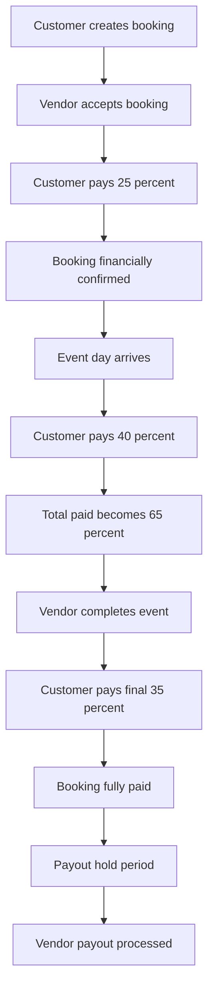

# PLANZO

Event services marketplace where customers discover and book vendors, vendors manage bookings and showcase their work, and admins moderate the platform.

## Vendor verification

Vendors use the guided flow at `/vendor/verification` to upload a Government ID, Business License, PAN Card, and Profile Photo; a GST Certificate is optional. PDF, JPG, PNG, and WEBP files up to 5 MB are accepted and stored in type-specific Cloudinary folders. Duplicate files across document types are rejected.

Submissions move through `pending`, `approved`, `rejected`, and `needs_resubmission`. Vendors can see the current status and review reason and replace documents after rejection or a resubmission request. Pending and approved submissions are locked. Administrators review image/PDF previews at `/admin/vendors/unverified`, approve, reject with a reason, or request resubmission with a reason.

The API uses a dedicated `VendorVerification` model with typed documents, `verificationHistory`, `reviewedBy`, and `reviewedAt`. Vendor endpoints are `GET /api/vendor/verification/me` and `POST /api/vendor/verification/submit`; admin endpoints are under `/api/admin/verifications`. Configure `CLOUDINARY_CLOUD_NAME`, `CLOUDINARY_API_KEY`, and `CLOUDINARY_API_SECRET` before accepting uploads.

PLANZO is split into two independent applications:

```text
Planzo/
├── frontend/   # React + Vite + Tailwind CSS
└── server/     # Node.js + Express + MongoDB
```

## Features

### Customer
- Browse and search vendors by category, location, and service type
- View vendor profiles with detailed info, ratings, availability, and portfolio
- Book services with date/time selection and availability checking
- Manage bookings with real-time status updates
- Leave reviews with star ratings, text, and up to 4 images
- Save favorite vendors and manage saved list
- Receive real-time notifications for booking updates

### Vendor
- Create and manage vendor profile with service details, pricing, and portfolio
- Set recurring business hours, holidays, blocked dates, and time slot duration
- Manage incoming booking requests (accept/reject/complete)
- View customer reviews and respond publicly
- Track bookings and manage availability
- Receive notifications for new bookings and reviews

### Admin
- Verify vendor profiles before they appear in search
- Flag inappropriate reviews with moderation reasons
- Suspend vendors when reports are substantiated
- View all bookings and filter by status
- Monitor reviews and reported vendors
- Dashboard with platform statistics

## Quick Start

### Start the frontend

```bash
cd frontend
npm install
npm run dev
```

Frontend runs at `http://localhost:5173` by default.

### Start the backend

```bash
cd server
cp .env.example .env
npm install
npm run dev
```

Backend runs at `http://localhost:5001` by default.

The frontend expects the API at `http://localhost:5001/api`. Override it with
`VITE_API_URL` in `frontend/.env` when needed.

## Key Features In Detail

### Notifications
- Real-time notification system across all user roles
- Customer notifications: booking status updates (accepted/rejected/completed), review replies
- Vendor notifications: new booking requests, reviews
- Admin notifications: reports and moderation tasks
- Mark notifications as read, delete, or clear all

### Bookings & Availability
- Smart availability system with recurring business hours, holidays, and blocked time slots
- Automatic conflict detection prevents double-booking
- Booking status flow: pending → accepted/rejected → completed
- Customers can only cancel pending/accepted bookings
- Vendors manage incoming requests with clear authorization

### Reviews & Ratings
- One review per completed booking per customer
- Up to 4 images per review (Cloudinary-backed)
- Star ratings (1-5) with text comments
- Automatic vendor rating recalculation on every review change
- Vendors can reply publicly to reviews
- Admins can flag reviews with moderation reasons

### Admin Moderation
- Review flagging with audit trail (status, flagged date, reason)
- Vendor suspension tracking (suspended status, suspension date)
- Report management: dismiss or suspend vendors
- Comprehensive admin dashboard with statistics

### Image Management
- All vendor images (profile, cover, portfolio) hosted on Cloudinary
- Review images with Cloudinary storage
- Automatic cleanup when deleting profiles or reviews
- Up to 8 portfolio images per vendor
- Secure image deletion from Cloudinary on profile removal

## Documentation

See [`server/README.md`](server/README.md) for:
- Environment variables setup
- Complete API routes reference
- Authorization rules by role
- Availability system details
- Cloudinary vendor image uploads
- Example curl requests
- Testing instructions
# Planzo payments

## Realtime chat

Planzo chat uses Socket.IO plus MongoDB-backed `Conversation` and `Message` records. Socket handshakes authenticate the existing HttpOnly `planzo_access` JWT cookie; REST endpoints under `/api/chat` use the same access rules. Booking conversations are restricted to the booking customer, vendor account, and admins. Direct one-to-one conversations can also be created with a participant ID.

Messages support Unicode emoji, up to five Cloudinary-backed image/file attachments of 10 MB each, full-text search, soft deletion, per-user conversation deletion, unread counters, delivery timestamps, seen receipts, typing events, online presence, and persisted last-seen timestamps. New messages also create Planzo notifications. Compound participant, booking, message-order, and text indexes support chat-list and history queries.

The responsive `/messages` UI provides a mobile conversation/chat split view, unread badges, presence and last-seen text, booking context, message search, attachment previews, emoji selection, typing feedback, receipts, deletion, and automatic scrolling. Configure `VITE_SOCKET_URL` only when the socket origin differs from the API origin; otherwise it is derived from `VITE_API_URL`.

## Production vendor search

`GET /api/vendors` uses a faceted MongoDB aggregation for instant text search, multiple categories, price, rating, experience, verified status, city, date availability, and GeoJSON radius filters. Sorting supports highest rated, lowest price, newest, popularity, most booked, and distance. Results use bounded pagination with `hasNextPage`; booking counts and popularity scores are calculated inside the pipeline.

Vendor profiles accept optional `latitude`, `longitude`, and `locationCity` values. Radius filtering requires stored coordinates and the `lat`, `lng`, and `radiusKm` query parameters. `GET /api/vendors/search/meta?q=` supplies cached city autocomplete suggestions. Composite and `2dsphere` indexes support the main access paths. Search responses use a bounded 30-second application cache and short browser/CDN cache headers; vendor profile mutations invalidate cached results.

The vendor directory includes debounced search, dual price sliders, category selection, autocomplete, browser-location radius search, availability dates, verification and experience filters, removable chips, responsive mobile filters, sorting, skeleton states, and intersection-observer infinite scrolling.

Planzo uses a provider-neutral payment service with Razorpay as the India provider. Booking and controller code never calls the Razorpay SDK directly; `PaymentProvider`, `RazorpayProvider`, and the factory isolate provider-specific orders, signatures, webhooks, refunds, and payouts. Amounts are integer paise.



Payment attempts live in the dedicated ledger. Captured entries project booking status as `pending` → `deposit_paid` → `partially_paid` → `paid`; refunds project `partially_refunded` or `refunded`. A later failure never erases captured progress. Payout state is separate and moves through `not_eligible`, `pending`, `processing`, and terminal/hold states.

## Razorpay setup and local testing

Copy `server/.env.example` to `server/.env`, use Razorpay test-mode keys, and set a distinct webhook secret. In the Razorpay dashboard, point the webhook to `https://YOUR_API/api/payments/webhooks/razorpay` and enable payment, refund, order, and payout events. The endpoint verifies the raw body and `X-Razorpay-Signature`; do not proxy it through middleware that rewrites JSON. Run `npm run payments:backfill` in `server` once for legacy bookings, then run backend tests with `npm test` and frontend tests/build with `npm test` and `npm run build` in `frontend`. Automated tests mock provider behavior and must not use live credentials.

All payment variables are documented in `server/.env.example`. Startup rejects percentage configurations that do not total 100, and production startup requires Razorpay credentials. Cancellation uses the free-window and fee settings; calculations should be recorded before refund initiation. Refunds are initiated by admins and finalized only by verified webhooks. A completed, fully paid, undisputed booking becomes payout-eligible after `VENDOR_PAYOUT_HOLD_DAYS`; platform fees and refund deductions are reflected separately.

Each captured installment receives a server-generated unique receipt number and downloadable PDF. The final installment is labeled as the consolidated invoice. Invoice access is restricted to the customer, associated vendor, or admin. Planzo stores no card, UPI, wallet, or bank credentials. Secrets and provider signatures are omitted from API responses. Adding Stripe requires implementing the existing provider interface and selecting it in the factory; booking eligibility and monetary state logic remain unchanged.

## Booking cancellation and refunds

Customers, vendors, and admins cancel through `POST /api/bookings/:id/cancel` with a required reason. The immutable cancellation record stores the actor and role, timestamp, policy snapshot, calculated percentage and amount, late fee, dispute details, reviewer, and timeline. Key status and amount fields are also projected onto `Booking` for customer and vendor dashboards.

Customer cancellations receive a full refund before `CANCELLATION_FREE_WINDOW_HOURS`, a configurable partial refund between that window and `CANCELLATION_PARTIAL_WINDOW_HOURS`, and no refund closer to or after the event. The late fee is deducted from partial refunds. Vendor and admin cancellations calculate a full refund of captured funds. All monetary values are integer paise.

Eligible refunds enter `pending_review`. Admins review them at `/admin/cancellations` and approve or reject with a reason. Approval distributes the refund safely across captured installments; Razorpay webhooks finalize `partially_refunded` or `refunded`. Customers and vendors can dispute non-final outcomes, and vendors can retrieve their cancellation history from `GET /api/bookings/vendor-history`.
